# @junkwon91/rn-design-system

[](https://github.com/JunKwon91/rn-design-system/actions/workflows/ci.yml)


React Native 디자인 시스템 라이브러리. `styled-components/native` 위에 라이트/다크 테마 토큰을 얹고, 8개 카테고리 37개 컴포넌트와 전역 imperative 유틸(Toast · Dialog · BottomSheet · Popup)을 제공합니다. Figma 원본과 1:1로 정합을 맞췄고, 모든 컴포넌트가 라이트/다크 두 모드를 지원합니다.

## 스크린샷

한 벌의 테마 토큰으로 라이트/다크가 함께 굴러갑니다.

| 라이트 | 다크 |
|:---:|:---:|
| 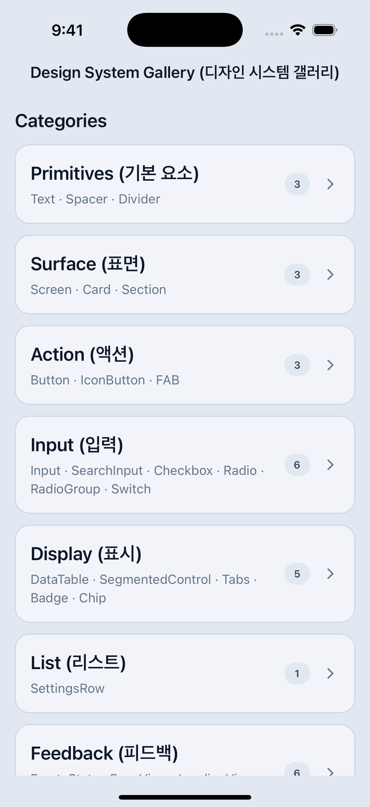 | 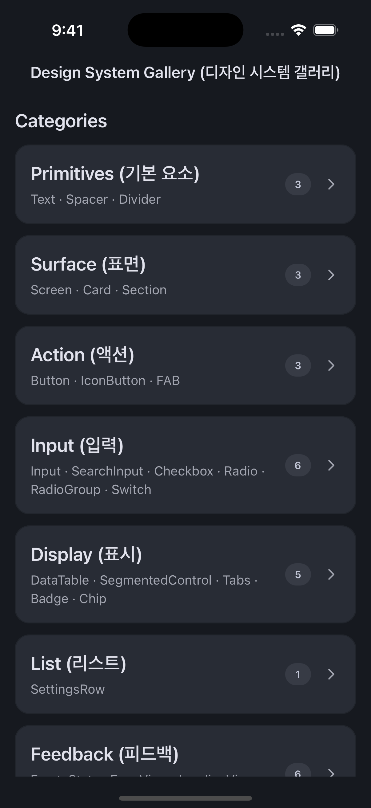 |

| | | |
|:---:|:---:|:---:|
| 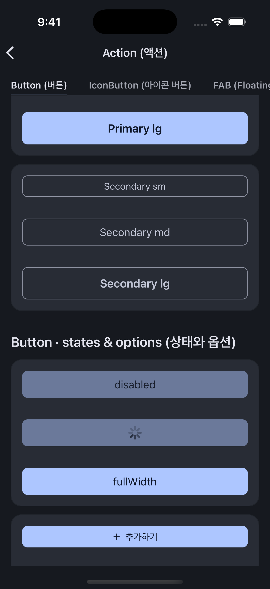 | 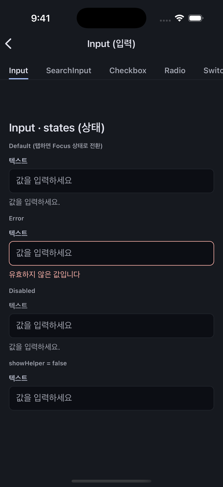 | 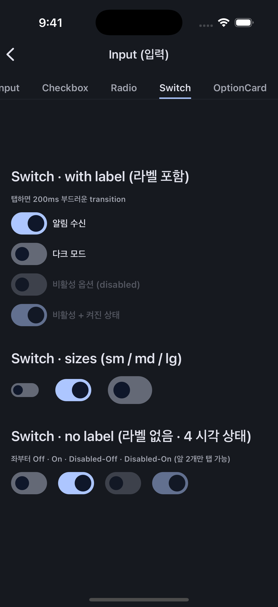 |
| **Button** — variant · size · 상태 | **Input** — 기본 · 에러 · 비활성 | **Switch** — M3 filled track |
| 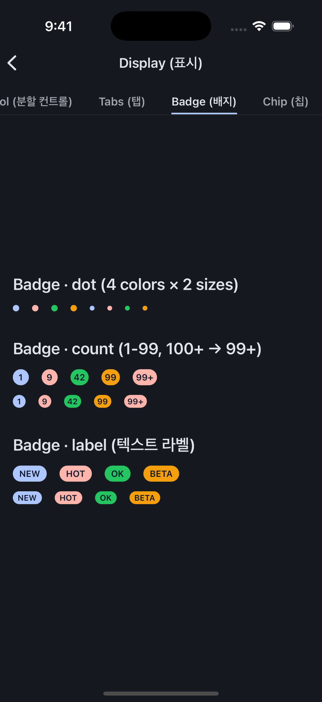 | 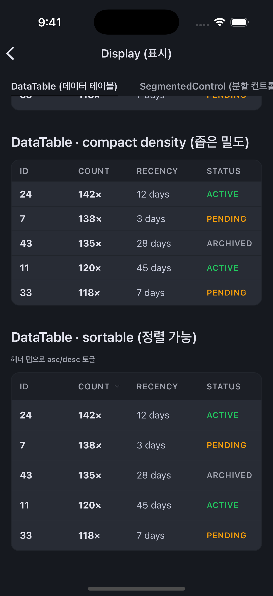 | 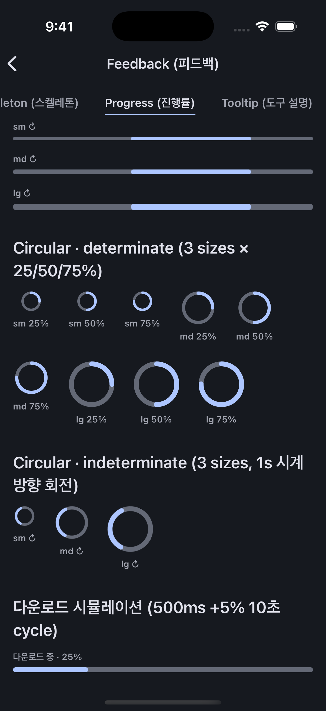 |
| **Badge** — dot · count · label | **DataTable** — 정렬 · 밀도 | **Progress** — Linear · Circular |
| 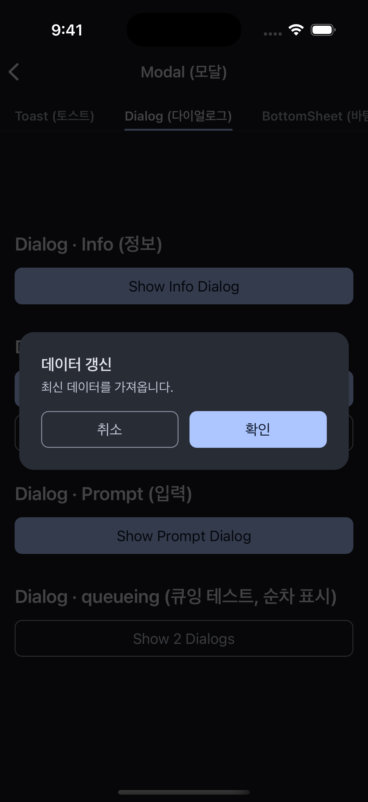 | 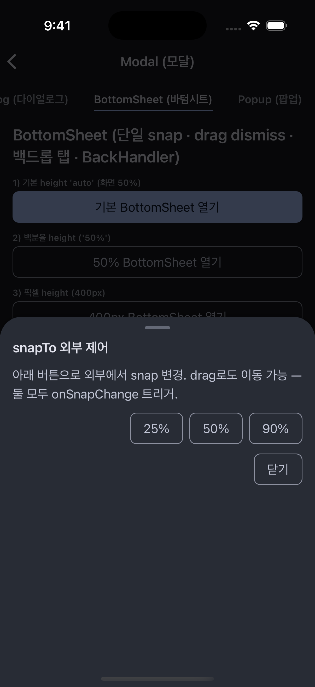 | 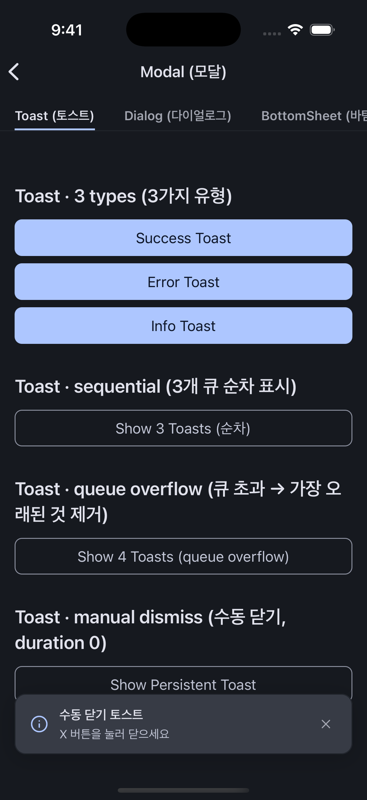 |
| **Dialog** — imperative 호출 | **BottomSheet** — drag · snap | **Toast** — 큐잉 · 자동 소멸 |

> 전체 컴포넌트의 라이트/다크 스크린샷과 props는 [docs/components.md](docs/components.md)에 있습니다.

## 특징

- **라이트/다크 완전 지원** — 한 벌의 시맨틱 토큰을 두 모드에 매핑. 컴포넌트 코드는 모드를 모르고, 테마만 바꾸면 전체가 전환됩니다.
- **2단계 색상 토큰** — primitive(원시 색) → semantic(의미 토큰) 구조. WCAG 대비를 측정해 토큰 값을 정했습니다.
- **전역 imperative 유틸** — `toast.success(...)`처럼 어디서든 호출. Zustand 스토어 + 앱 루트 Host 1회 마운트로 동작하며, 큐잉·순차 표시를 관리합니다.
- **Reanimated v4 애니메이션** — Switch·SegmentedControl·BottomSheet·Progress·Tooltip 등에 UI 스레드 애니메이션 적용.
- **Figma 원본 정합** — 각 컴포넌트가 Figma Variable과 1:1로 맞춰져 있습니다.
- **타입 안전** — 앱에서 `DefaultTheme`을 `AppTheme`으로 확장하면 styled 콜백 안에서 토큰 자동완성·오타 검사가 동작합니다.
- **테스트 & CI** — 스토어 유닛 + 컴포넌트 접근성 쿼리 테스트, GitHub Actions로 lint·타입체크·테스트·빌드를 Node 22/24에서 검증합니다.

## 한눈에

| 항목 | 값 |
|---|---|
| 컴포넌트 | 37개 (시각 33 + Host 4), 8개 카테고리 |
| 테마 | 라이트/다크, 2단계 토큰(primitive + semantic) |
| 코어 | React Native 0.81+ · React 19 · TypeScript · styled-components 6 |
| 애니메이션 | Reanimated v4 (+ react-native-worklets) |
| 상태·아이콘 | Zustand · lucide-react-native |
| 배포 | GitHub 태그 설치 (npm 레지스트리 미배포, `private`) |
| 설계 기록 | [DECISIONS.md](DECISIONS.md) — ADR 47건 |

## 컴포넌트

| 카테고리 | 수 | 컴포넌트 |
|---|---|---|
| primitives | 3 | Text · Spacer · Divider |
| surface | 3 | Screen · Card · Section |
| action | 3 | Button · IconButton · FAB |
| input | 7 | Input · SearchInput · Checkbox · Radio · RadioGroup · OptionCard · Switch |
| display | 5 | DataTable · SegmentedControl · Tabs · Badge · Chip |
| list | 1 | SettingsRow |
| feedback | 7 | EmptyState · ErrorView · LoadingView · Skeleton · LinearProgress · CircularProgress · Tooltip |
| modal | 8 | Toast · Dialog · BottomSheet · Popup (+ 각 Host) |

각 컴포넌트의 props 레퍼런스와 스크린샷: [docs/components.md](docs/components.md)

## 설치

npm 레지스트리에 배포하지 않고 GitHub 태그로 설치합니다.

```bash
npm install '@junkwon91/rn-design-system@github:JunKwon91/rn-design-system#v2.1.1'
```

설치 시 `prepare` 스크립트가 `react-native-builder-bob` 빌드를 실행해 `lib/` 산출물을 생성합니다. peer 의존성 8종은 앱이 직접 설치하며, 한 패키지라도 두 벌이 설치되면 Context·네이티브 모듈 등록이 깨지므로 단일 인스턴스를 보장해야 합니다(`npm ls`로 deduped 확인).

```bash
npm install \
  react react-native styled-components \
  react-native-reanimated react-native-gesture-handler \
  react-native-safe-area-context react-native-svg react-native-worklets
```

<details>
<summary>peer 의존성 버전 표</summary>

| 패키지 | 범위 | 단일 인스턴스 필요 이유 |
|---|---|---|
| react | `>=19.0.0` | renderer |
| react-native | `>=0.81.0` | 네이티브 브리지 |
| styled-components | `>=6.0.0` | ThemeContext |
| react-native-reanimated | `>=4.0.0` | worklet runtime · UI thread |
| react-native-gesture-handler | `>=2.0.0` | 네이티브 등록 |
| react-native-safe-area-context | `>=5.0.0` | SafeAreaProvider Context |
| react-native-svg | `>=15.0.0` | 네이티브 view 등록 |
| react-native-worklets | `>=0.8.0` | reanimated 4 의존 |

`react-native-reanimated` 셋업 시 `babel.config.js`에 `'react-native-worklets/plugin'`을 마지막 plugin으로 추가해야 합니다. dependencies(`lucide-react-native`, `zustand`)는 라이브러리가 함께 끌어오므로 별도 설치가 필요 없습니다.

</details>

## 빠른 시작

앱 루트에 세 가지를 한 번 셋업합니다: **테마 타입 확장** · **Provider 중첩** · **imperative Host 마운트**.

```tsx
import { useColorScheme } from 'react-native';
import { GestureHandlerRootView } from 'react-native-gesture-handler';
import { SafeAreaProvider } from 'react-native-safe-area-context';
import { ThemeProvider } from 'styled-components/native';
import {
  lightTheme, darkTheme,
  DialogHost, ToastHost, BottomSheetHost, PopupHost,
} from '@junkwon91/rn-design-system';

import RootNavigator from './src/navigation/RootNavigator';

export default function App() {
  const theme = useColorScheme() === 'dark' ? darkTheme : lightTheme;
  return (
    <GestureHandlerRootView style={{ flex: 1 }}>
      <ThemeProvider theme={theme}>
        <SafeAreaProvider>
          <RootNavigator />
          {/* imperative Host — 쓰는 것만 마운트 */}
          <DialogHost />
          <ToastHost />
          <BottomSheetHost />
          <PopupHost />
        </SafeAreaProvider>
      </ThemeProvider>
    </GestureHandlerRootView>
  );
}
```

이후 화면에서는 컴포넌트를 바로 조합하고, imperative 유틸을 어디서든 호출합니다.

```tsx
import { Screen, Card, Text, Button, toast } from '@junkwon91/rn-design-system';

export default function HomeScreen() {
  return (
    <Screen>
      <Card title="이번 달" meta="2026-06" showDivider>
        <Text variant="bodyBase">최근 활동이 12건 있습니다.</Text>
        <Button label="자세히" onPress={() => toast.success('불러오는 중')} />
      </Card>
    </Screen>
  );
}
```

<details>
<summary>테마 타입 확장 (styled 자동완성)</summary>

`src/styled.d.ts`에서 `DefaultTheme`을 `AppTheme`으로 보강하면 styled 콜백 안에서 `theme.colors.x` 자동완성과 오타 검사가 동작합니다. 라이브러리는 `DefaultTheme`을 점유하지 않고 타입만 export하므로, 값 주입은 앱이 담당합니다.

```ts
import 'styled-components';
import 'styled-components/native';
import type { AppTheme } from '@junkwon91/rn-design-system';

declare module 'styled-components' {
  export interface DefaultTheme extends AppTheme {}
}
declare module 'styled-components/native' {
  export interface DefaultTheme extends AppTheme {}
}
```

도메인 토큰을 더하는 방법은 [docs/theme.md](docs/theme.md)를 참고하세요.

</details>

## 문서

- [docs/theme.md](docs/theme.md) — AppTheme 구조 · 토큰 레퍼런스 · 앱에서 테마 확장
- [docs/components.md](docs/components.md) — 컴포넌트별 props + 라이트/다크 스크린샷
- [docs/imperative.md](docs/imperative.md) — toast/dialog/bottomSheet/popup 셋업 + 호출 API
- [DECISIONS.md](DECISIONS.md) — 설계 의사결정 기록(ADR 47건)

## 개발

```bash
npm test          # jest — 스토어 유닛 + 컴포넌트 접근성 쿼리
npm run lint      # eslint
npm run typecheck # tsc --noEmit (루트 tsconfig)
npm run prepare   # react-native-builder-bob 빌드 → lib/
```

PR과 main 푸시 시 GitHub Actions(CI)가 Node 22·24에서 lint → 타입체크 → 테스트 → 빌드를 검증합니다.

## 라이선스

MIT — Copyright (c) 2026 JunKwon91
