# Components

37종 컴포넌트의 props 레퍼런스와 사용 예시입니다. 각 컴포넌트는 `AppTheme` 토큰을 기본 동작에 자동 적용하고, 필요하면 `style` prop으로 시각 속성을 추가로 재정의할 수 있습니다. 토큰 구조 자체는 [docs/theme.md](theme.md)를 참고하세요.

- [공통 — InteractivePressableProps](#공통--interactivepressableprops)
- [primitives](#primitives) — Text · Spacer · Divider
- [surface](#surface) — Screen · Card · Section
- [action](#action) — Button · IconButton · FAB
- [input](#input) — Input · SearchInput · Checkbox · Radio · RadioGroup · Switch · OptionCard
- [display](#display) — DataTable · SegmentedControl · Tabs · Badge · Chip
- [list](#list) — SettingsRow
- [feedback](#feedback) — EmptyState · ErrorView · LoadingView · Skeleton · LinearProgress · CircularProgress · Tooltip
- [modal](#modal) — Toast · Dialog · BottomSheet · Popup (시각 컴포넌트; Host 마운트와 호출은 [docs/imperative.md](imperative.md))
- [icons](#icons) — createIcon · Check (커스텀 SVG 아이콘)

---

## 공통 — InteractivePressableProps

탭/롱프레스 인터랙션을 가진 컴포넌트는 RN `Pressable`의 인터랙티브 props 일부를 그대로 넘길 수 있도록 다음 타입을 함께 받습니다:

```ts
type InteractivePressableProps = Pick<PressableProps,
  | 'onLongPress'
  | 'onPressIn'
  | 'onPressOut'
  | 'delayLongPress'
  | 'hitSlop'
  | 'accessibilityHint'
  | 'testID'
>;
```

이 타입을 extends하는 컴포넌트: **Button**, **IconButton**, **FAB**, **Chip**, **Switch**. 각 컴포넌트의 자체 props에 더해 위 7개 prop을 그대로 전달할 수 있습니다.

---

## primitives

### Text

본문·제목·라벨·숫자 등 모든 텍스트를 표시합니다. `variant`로 typography 토큰(11종)을 선택하고, `color`로 의미 색 토큰을 적용합니다.

| prop | 타입 | 필수 | 기본값 |
|---|---|---|---|
| `variant` | `TextVariant` | — | `'bodyBase'` |
| `color` | `TextColor` | — | `'primary'` |
| `align` | `'left' \| 'center' \| 'right'` | — | `'left'` |
| `numberOfLines` | `number` | — | — |
| `children` | `ReactNode` | ✓ | — |
| `style` | `StyleProp<TextStyle>` | — | — |

| Light | Dark |
|---|---|
|  |  |

`TextVariant` 11종은 [docs/theme.md#typography](theme.md#typography) 참고. `TextColor`는 `'primary' | 'secondary' | 'muted' | 'accent' | 'inverse'` 다섯 값이며 다음과 같이 매핑됩니다:

| color 값 | 매핑되는 토큰 |
|---|---|
| `primary` | `colors.text.primary` |
| `secondary` | `colors.text.secondary` |
| `muted` | `colors.text.muted` |
| `accent` | `colors.primary.action` (브랜드 강조) |
| `inverse` | `colors.text.primaryInverse` (반전 표면 위) |

```tsx
<Text variant="headlineMd" color="primary">최근 활동</Text>
<Text variant="bodySm" color="muted">2026-05-20</Text>
<Text variant="labelCaps" color="accent">NEW</Text>
```

### Spacer

요소 사이 간격을 토큰 단위로 채웁니다. `size`로 spacing 토큰을 선택하고, `axis`로 수직(`'vertical'`) 또는 수평(`'horizontal'`) 간격을 결정합니다.

| prop | 타입 | 필수 | 기본값 |
|---|---|---|---|
| `size` | `SpacerSize` (`'xs' \| 'sm' \| 'md' \| 'lg' \| 'xl' \| '2xl' \| '3xl' \| '4xl'`) | ✓ | — |
| `axis` | `'vertical' \| 'horizontal'` | — | `'vertical'` |

*이미지 준비중*

```tsx
<Spacer size="md" />
<Spacer size="xl" axis="horizontal" />
```

### Divider

영역을 나누는 1px 구분선입니다. `color`로 강도(subtle/default/strong)를 선택하고, `inset`으로 좌우 들여쓰기를 줍니다.

| prop | 타입 | 필수 | 기본값 |
|---|---|---|---|
| `orientation` | `'horizontal' \| 'vertical'` | — | `'horizontal'` |
| `color` | `'subtle' \| 'default' \| 'strong'` | — | `'subtle'` |
| `inset` | `number` | — | `0` |

*이미지 준비중*

```tsx
<Divider />
<Divider color="strong" inset={16} />
<Divider orientation="vertical" />
```

---

## surface

### Screen

화면 전체를 감싸는 최상위 컨테이너입니다. `react-native-safe-area-context`와 통합해 `edges` prop만으로 safe area 패딩을 자동 처리합니다.

| prop | 타입 | 필수 | 기본값 |
|---|---|---|---|
| `edges` | `ScreenEdge[]` (`'top' \| 'right' \| 'bottom' \| 'left'`) | — | `['top']` |
| `scroll` | `boolean` | — | `false` |
| `padded` | `boolean` | — | `true` |
| `background` | `'canvas' \| 'sectionMain' \| 'sectionSub'` | — | `'canvas'` |
| `contentContainerStyle` | `StyleProp<ViewStyle>` | — | — |
| `style` | `StyleProp<ViewStyle>` | — | — |
| `children` | `ReactNode` | ✓ | — |

*이미지 준비중*

```tsx
<Screen>
  <Text variant="headlineSm">제목</Text>
</Screen>

<Screen scroll edges={['top', 'bottom']}>
  {/* 긴 콘텐츠 */}
</Screen>
```

### Card

관련된 내용을 묶는 표면 컨테이너입니다. `surface.container` 배경과 `radius.lg`를 기본으로 사용하고, `title`/`meta`로 헤더를 자동 구성합니다. variant는 `outlined`(1px `border.subtle`, 독립 정보 패널) / `filled`(무테, 반복 리스트 항목)로 구분합니다.

| prop | 타입 | 필수 | 기본값 |
|---|---|---|---|
| `variant` | `'outlined' \| 'filled'` | — | `'outlined'` |
| `density` | `'default' \| 'compact'` | — | `'default'` |
| `title` | `string` | — | — |
| `meta` | `string` | — | — |
| `showDivider` | `boolean` | — | `false` |
| `style` | `StyleProp<ViewStyle>` | — | — |
| `children` | `ReactNode` | ✓ | — |

| Light | Dark |
|---|---|
| 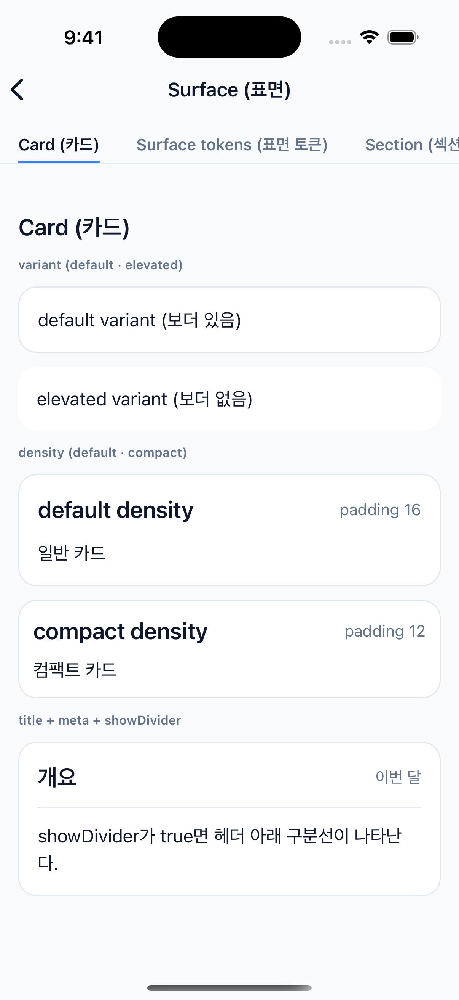 | 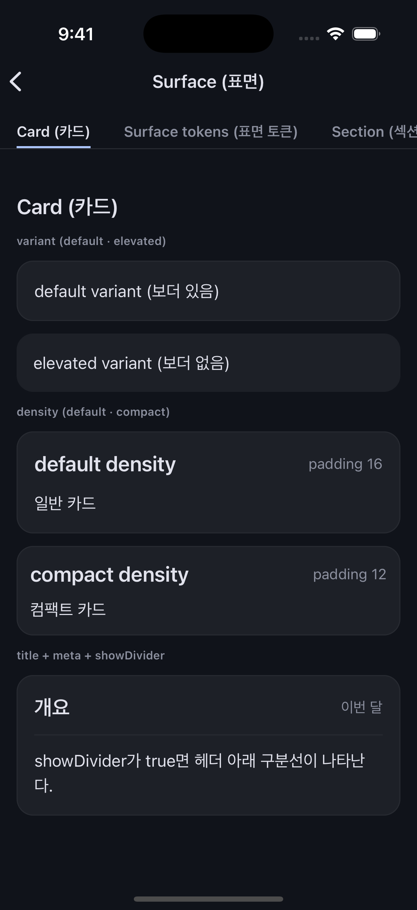 |

```tsx
<Card title="이번 달" meta="2026-06" showDivider>
  <Text>최근 활동이 12건 있습니다.</Text>
</Card>

<Card density="compact">
  <Text variant="bodySm">목록 항목</Text>
</Card>
```

### Section

페이지 안의 논리적 영역을 묶는 컴포넌트입니다. `title`과 `action`(우측 보조 UI)을 받고, `spacing`으로 자식 사이 간격을 3단계로 제어합니다(`compact`=8px, `default`=12px, `roomy`=16px).

| prop | 타입 | 필수 | 기본값 |
|---|---|---|---|
| `title` | `string` | — | — |
| `action` | `ReactNode` | — | — |
| `spacing` | `'compact' \| 'default' \| 'roomy'` | — | `'default'` |
| `style` | `StyleProp<ViewStyle>` | — | — |
| `children` | `ReactNode` | ✓ | — |

*이미지 준비중*

```tsx
<Section title="알림">
  <Card>...</Card>
  <Card>...</Card>
</Section>
```

---

## action

### Button

화면의 명시적 액션을 트리거합니다. `variant`로 시각적 위계(primary/secondary/destructive), `size`로 높이를 선택합니다. **InteractivePressableProps 포함**.

| prop | 타입 | 필수 | 기본값 |
|---|---|---|---|
| `label` | `string` | ✓ | — |
| `variant` | `'primary' \| 'secondary' \| 'destructive'` | — | `'primary'` |
| `size` | `'sm' \| 'md' \| 'lg'` | — | `'md'` |
| `disabled` | `boolean` | — | `false` |
| `loading` | `boolean` | — | `false` |
| `leftIcon` | `ReactNode` | — | — |
| `fullWidth` | `boolean` | — | `false` |
| `onPress` | `() => void` | ✓ | — |
| `style` | `StyleProp<ViewStyle>` | — | — |
| `accessibilityLabel` | `string` | — | — |

| Light | Dark |
|---|---|
| 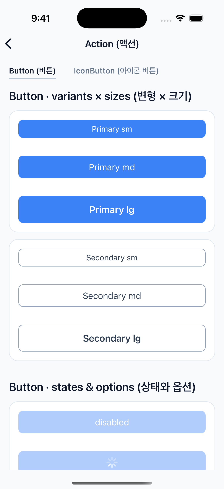 |  |

`loading: true`는 자체적으로 `disabled` 효과를 포함합니다. `variant='destructive'`는 `state.errorAction` 배경 + 흰 텍스트로 표시되어 삭제·되돌릴 수 없는 액션에 사용합니다.

```tsx
<Button label="저장" onPress={handleSave} />
<Button label="삭제" variant="destructive" onPress={confirmDelete} />
<Button label="제출 중" loading onPress={handleSubmit} />
```

### IconButton

아이콘 하나만으로 액션을 트리거합니다. M3 표준 hitSlop(48×48)을 자동으로 적용해 작은 시각 크기에서도 터치 영역이 보장됩니다. **InteractivePressableProps 포함**.

| prop | 타입 | 필수 | 기본값 |
|---|---|---|---|
| `icon` | `ReactNode` | ✓ | — |
| `size` | `'sm' \| 'md' \| 'lg'` | — | `'md'` |
| `color` | `'primary' \| 'secondary' \| 'muted' \| 'accent'` | — | `'secondary'` |
| `disabled` | `boolean` | — | `false` |
| `accessibilityLabel` | `string` | ✓ | — |
| `onPress` | `() => void` | ✓ | — |
| `style` | `StyleProp<ViewStyle>` | — | — |

*이미지 준비중*

`accessibilityLabel`은 필수입니다(아이콘만 보이는 컴포넌트라 스크린리더용 라벨이 보장되어야 합니다).

```tsx
import { Settings, Search } from 'lucide-react-native';

<IconButton icon={<Settings />} onPress={openSettings} accessibilityLabel="설정" />
<IconButton icon={<Search />} size="lg" color="accent" onPress={search} accessibilityLabel="검색" />
```

### FAB

화면 위에 떠 있는 주요 액션 버튼입니다. **InteractivePressableProps 포함**.

| prop | 타입 | 필수 | 기본값 |
|---|---|---|---|
| `variant` | `'small' \| 'default' \| 'large' \| 'extended'` | — | `'default'` |
| `icon` | `ReactNode` | ✓ | — |
| `label` | `string` | extended 한정 | — |
| `disabled` | `boolean` | — | `false` |
| `onPress` | `() => void` | ✓ | — |
| `style` | `StyleProp<ViewStyle>` | — | — |
| `accessibilityLabel` | `string` | — | — |

| Light | Dark |
|---|---|
| 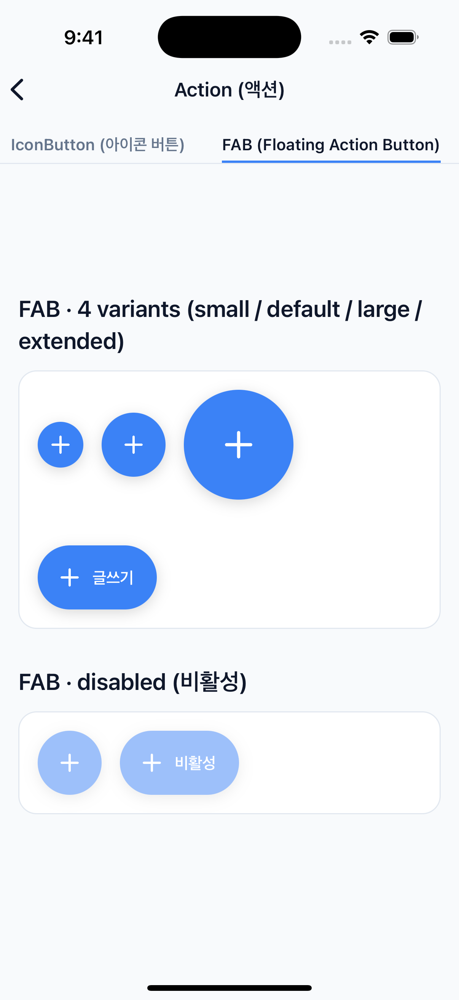 | 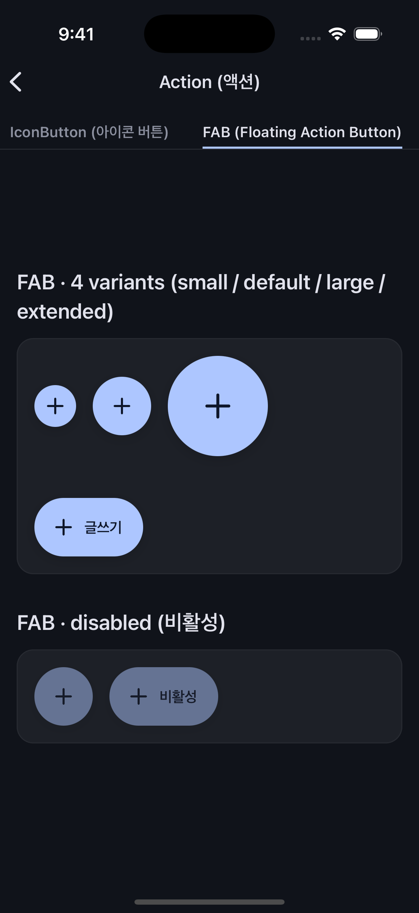 |

`variant='extended'`는 라벨이 함께 노출되는 가로형 FAB로, `label`을 함께 전달합니다.

```tsx
import { Plus } from 'lucide-react-native';

<FAB icon={<Plus />} onPress={openSheet} accessibilityLabel="추가" />
<FAB variant="extended" icon={<Plus />} label="글쓰기" onPress={write} />
```

---

## input

### Input

한 줄 텍스트 입력입니다. RN `TextInput`의 props를 모두 받고(`style` 제외), 그 위에 라벨·에러·헬퍼 텍스트 시각 영역을 추가합니다.

| prop | 타입 | 필수 | 기본값 |
|---|---|---|---|
| `label` | `string` | — | — |
| `value` | `string` | — | — |
| `placeholder` | `string` | — | — |
| `helper` | `string` | — | — |
| `showHelper` | `boolean` | — | `true` |
| `error` | `string` | — | — |
| `disabled` | `boolean` | — | `false` |
| `onChangeText` | `(text: string) => void` | — | — |
| `style` | `StyleProp<ViewStyle>` | — | — |
| (RN `TextInputProps`) | `Omit<TextInputProps, 'style'>` | — | — |

| Light | Dark |
|---|---|
| 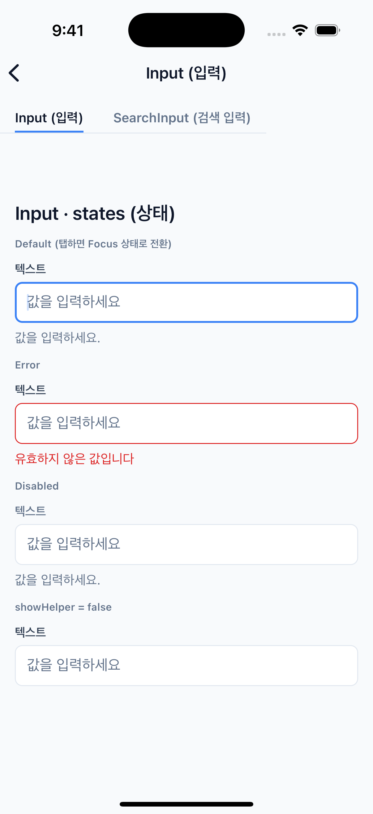 |  |

`error`가 있으면 보더와 helper 영역이 에러 상태로 전환됩니다. `showHelper: false`는 라벨/에러가 없을 때 helper 영역의 빈 공간을 제거합니다.

```tsx
const [email, setEmail] = useState('');

<Input
  label="이메일"
  value={email}
  onChangeText={setEmail}
  keyboardType="email-address"
  autoCapitalize="none"
  helper="로그인에 사용됩니다"
/>

<Input label="비밀번호" secureTextEntry error="8자 이상 입력하세요" />
```

### SearchInput

검색어 전용 입력입니다. 좌측에 검색 아이콘, 입력 시 우측에 지우기(`X`) 버튼이 자동으로 표시됩니다.

| prop | 타입 | 필수 | 기본값 |
|---|---|---|---|
| `value` | `string` | ✓ | — |
| `placeholder` | `string` | — | — |
| `onChangeText` | `(text: string) => void` | ✓ | — |
| `onClear` | `() => void` | — | — |
| `autoFocus` | `boolean` | — | — |
| `style` | `StyleProp<ViewStyle>` | — | — |

*이미지 준비중*

```tsx
const [q, setQ] = useState('');

<SearchInput
  value={q}
  onChangeText={setQ}
  placeholder="검색어 입력"
  onClear={() => trackClear()}
/>
```

### Checkbox

다중 선택용 체크박스입니다.

| prop | 타입 | 필수 | 기본값 |
|---|---|---|---|
| `value` | `boolean` | ✓ | — |
| `onValueChange` | `(value: boolean) => void` | — | — |
| `label` | `ReactNode` | — | — |
| `size` | `'sm' \| 'md' \| 'lg'` | — | `'md'` |
| `disabled` | `boolean` | — | `false` |
| `style` | `StyleProp<ViewStyle>` | — | — |
| `testID` | `string` | — | — |
| `accessibilityLabel` | `string` | — | — |

| Light | Dark |
|---|---|
| 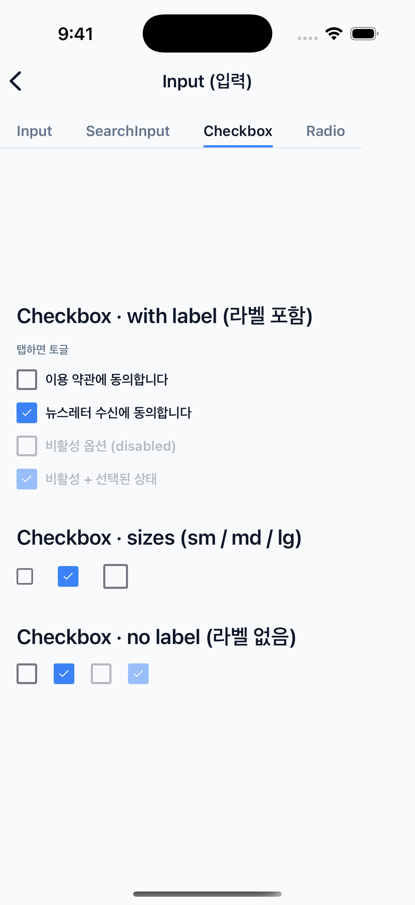 | 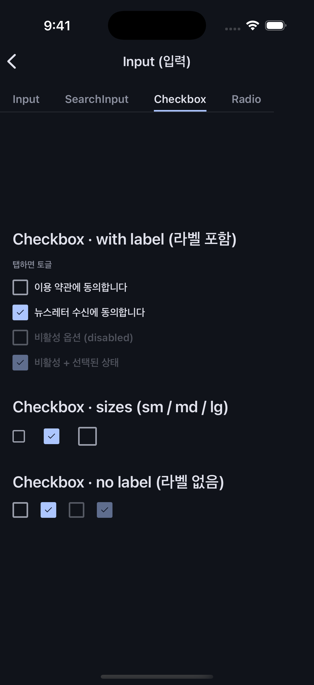 |

```tsx
const [agreed, setAgreed] = useState(false);

<Checkbox value={agreed} onValueChange={setAgreed} label="약관에 동의합니다" />
<Checkbox value disabled />
```

### Radio · RadioGroup

여러 항목 중 하나만 선택하는 라디오입니다. `Radio`는 그룹 안에서만 의미가 있어 `RadioGroup`이 값과 핸들러를 컨텍스트로 공유합니다.

**Radio**:

| prop | 타입 | 필수 | 기본값 |
|---|---|---|---|
| `value` | `string` | ✓ | — |
| `label` | `ReactNode` | — | — |
| `size` | `'sm' \| 'md' \| 'lg'` | — | `'md'` |
| `disabled` | `boolean` | — | `false` |
| `style` | `StyleProp<ViewStyle>` | — | — |
| `testID` | `string` | — | — |
| `accessibilityLabel` | `string` | — | — |

**RadioGroup**:

| prop | 타입 | 필수 | 기본값 |
|---|---|---|---|
| `value` | `T extends string` | ✓ | — |
| `onValueChange` | `(value: T) => void` | ✓ | — |
| `children` | `ReactNode` | ✓ | — |
| `disabled` | `boolean` | — | `false` |
| `style` | `StyleProp<ViewStyle>` | — | — |
| `testID` | `string` | — | — |
| `accessibilityLabel` | `string` | — | — |

| Light | Dark |
|---|---|
| 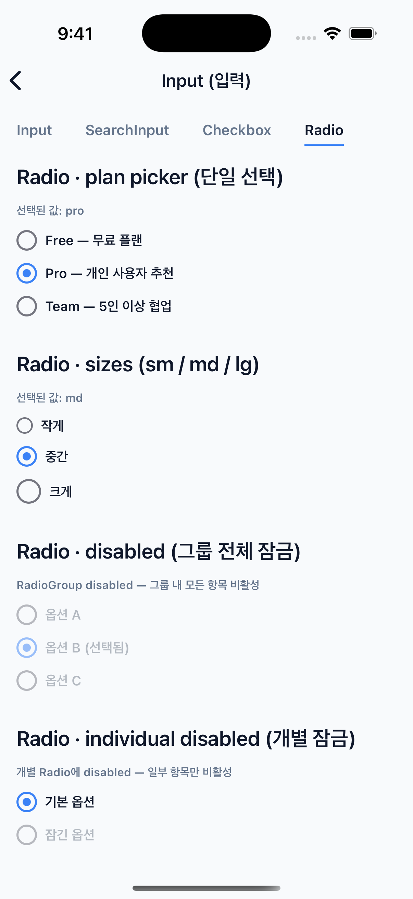 | 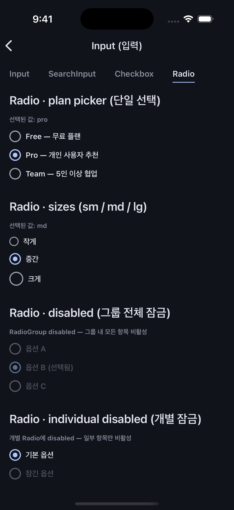 |

```tsx
type Plan = 'free' | 'pro' | 'team';
const [plan, setPlan] = useState<Plan>('pro');

<RadioGroup value={plan} onValueChange={setPlan}>
  <Radio value="free" label="Free" />
  <Radio value="pro" label="Pro" />
  <Radio value="team" label="Team" disabled />
</RadioGroup>
```

### Switch

켜고 끄기. **InteractivePressableProps 포함**.

| prop | 타입 | 필수 | 기본값 |
|---|---|---|---|
| `value` | `boolean` | ✓ | — |
| `onValueChange` | `(value: boolean) => void` | — | — |
| `label` | `ReactNode` | — | — |
| `size` | `'sm' \| 'md' \| 'lg'` | — | `'md'` |
| `disabled` | `boolean` | — | `false` |
| `style` | `StyleProp<ViewStyle>` | — | — |
| `accessibilityLabel` | `string` | — | — |

| Light | Dark |
|---|---|
| 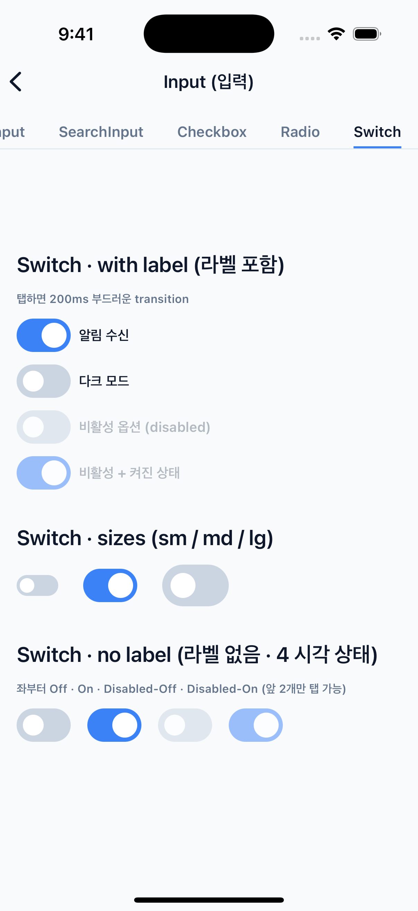 | 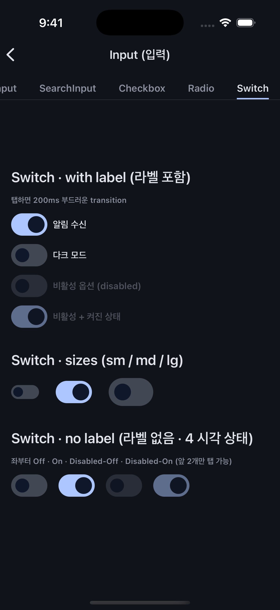 |

```tsx
const [dark, setDark] = useState(false);

<Switch value={dark} onValueChange={setDark} label="다크 모드" />
<Switch value disabled />
```

### OptionCard

아이콘 + 제목/설명 + 선택 표시로 구성된 "하나를 고르는" 선택형 카드입니다. 카드 전체가 탭 영역이며, 그룹 내 단일 선택은 소비 측이 관리합니다(`accessibilityRole="radio"`). 폼 컨트롤 Radio/Checkbox와는 다른 층위 — 카드 자체가 선택 대상입니다. 아이콘은 `icon` slot으로 주입합니다.

| prop | 타입 | 필수 | 기본값 |
|---|---|---|---|
| `selected` | `boolean` | ✓ | — |
| `title` | `string` | ✓ | — |
| `description` | `string` | — | — |
| `icon` | `ReactNode` | — | — |
| `onPress` | `() => void` | — | — |
| `disabled` | `boolean` | — | `false` |
| `style` | `StyleProp<ViewStyle>` | — | — |
| `accessibilityLabel` | `string` | — | — |
| `testID` | `string` | — | — |

`selected`: 파란 테두리 + 채운 원 + Check / unselected: 무테 + 링.

```tsx
import { Flame } from 'lucide-react-native';

const [mode, setMode] = useState<'hot' | 'cold'>('hot');

<OptionCard
  selected={mode === 'hot'}
  title="Hot 추천"
  description="최근 출현 빈도가 높은 번호 중심"
  icon={<Flame size={28} />}
  onPress={() => setMode('hot')}
/>
```

---

## display

### DataTable

표 형태로 데이터를 나열합니다. `columns` 정의로 각 열의 렌더링·정렬을 제어하고, generic으로 행 타입(`T`)이 좁혀집니다.

| prop | 타입 | 필수 | 기본값 |
|---|---|---|---|
| `columns` | `DataTableColumn<T>[]` | ✓ | — |
| `data` | `T[]` | ✓ | — |
| `density` | `'default' \| 'compact'` | — | `'default'` |
| `sortable` | `boolean` | — | `false` |
| `sortKey` | `string` | — | — |
| `sortDirection` | `'asc' \| 'desc'` | — | — |
| `onSort` | `(key: string, direction: 'asc' \| 'desc') => void` | — | — |
| `keyExtractor` | `(row: T, index: number) => string` | — | — |
| `style` | `StyleProp<ViewStyle>` | — | — |

| Light | Dark |
|---|---|
|  | 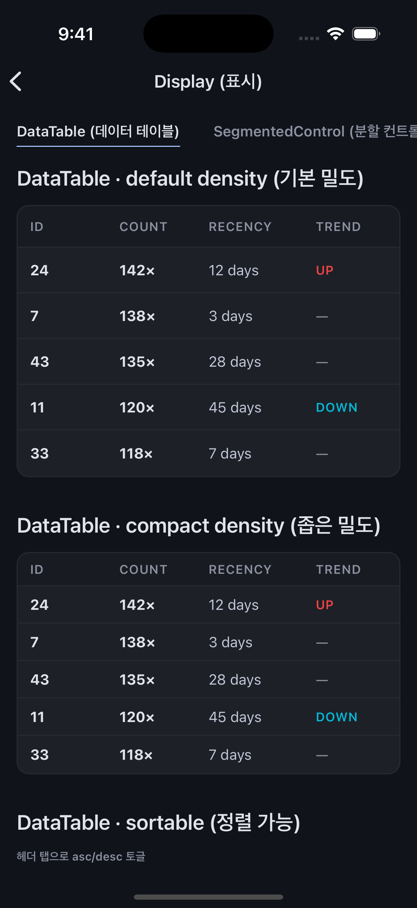 |

`DataTableColumn<T>`은 `key`/`header`/`render`/`align`/`flex`/`sortable` 등을 포함하며, `sortable` 옵션으로 특정 열의 정렬을 켤 수 있습니다.

```tsx
const columns: DataTableColumn<Row>[] = [
  { key: 'name', header: '이름', render: row => row.name },
  { key: 'score', header: '점수', align: 'right', render: row => row.score },
];

<DataTable
  columns={columns}
  data={rows}
  sortable
  sortKey="score"
  sortDirection="desc"
  onSort={(key, dir) => setSort({ key, dir })}
/>
```

### SegmentedControl

여러 옵션 중 하나를 가로 분할 형태로 선택합니다. generic으로 `value` 타입이 좁혀집니다.

| prop | 타입 | 필수 | 기본값 |
|---|---|---|---|
| `segments` | `SegmentedControlSegment<T>[]` | ✓ | — |
| `value` | `T` | ✓ | — |
| `onChange` | `(value: T) => void` | ✓ | — |
| `style` | `StyleProp<ViewStyle>` | — | — |

| Light | Dark |
|---|---|
| 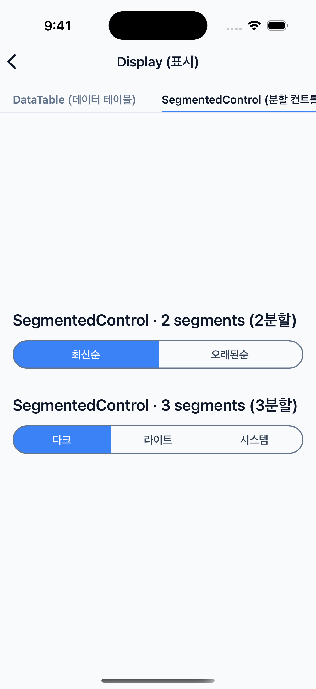 | 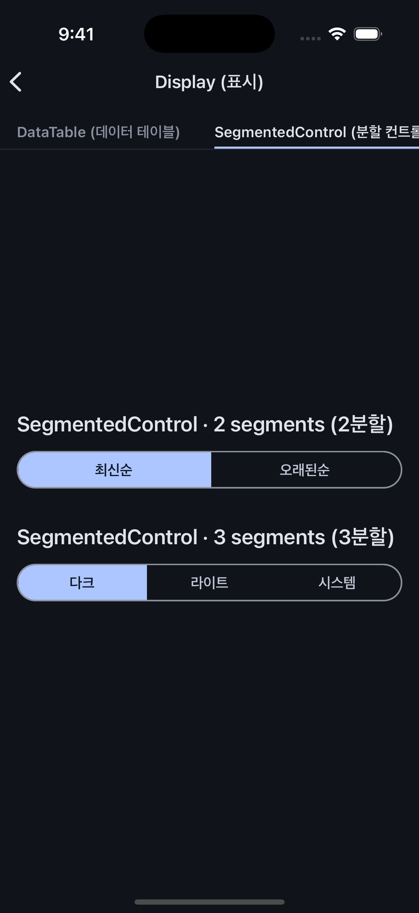 |

각 `segment`는 `value`/`label`을 가지며 `disabled?: boolean`로 비활성화할 수 있습니다.

```tsx
type Sort = 'recent' | 'popular';
const [sort, setSort] = useState<Sort>('recent');

<SegmentedControl
  segments={[
    { value: 'recent', label: '최신순' },
    { value: 'popular', label: '인기순' },
  ]}
  value={sort}
  onChange={setSort}
/>
```

### Tabs

여러 화면을 가로 탭으로 전환합니다. M3 underline tabs 스타일.

| prop | 타입 | 필수 | 기본값 |
|---|---|---|---|
| `tabs` | `TabItem<T>[]` | ✓ | — |
| `value` | `T` | ✓ | — |
| `onChange` | `(value: T) => void` | ✓ | — |
| `style` | `StyleProp<ViewStyle>` | — | — |

| Light | Dark |
|---|---|
| 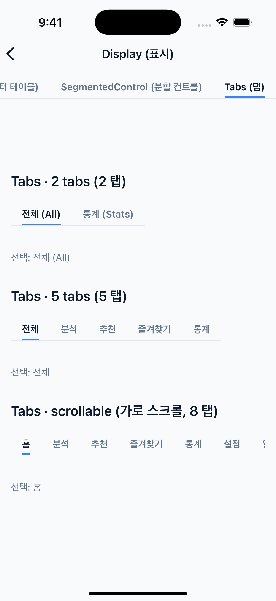 | 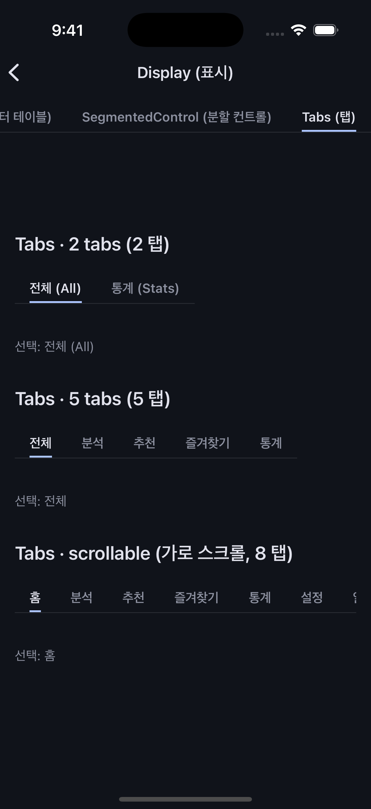 |

각 `TabItem`은 `value`/`label`을 가지며 옵션으로 `icon?: ReactNode`(라벨 앞), `badge?: number | string`(라벨 뒤; number는 카운트 99+ 자동 처리), `disabled?: boolean`을 받습니다.

```tsx
import { Star } from 'lucide-react-native';

const [active, setActive] = useState('all');

<Tabs
  tabs={[
    { value: 'all', label: '전체' },
    { value: 'stats', label: '통계', badge: 3 },
    { value: 'favorites', label: '즐겨찾기', icon: <Star size={16} /> },
    { value: 'archived', label: '보관함', disabled: true },
  ]}
  value={active}
  onChange={setActive}
/>
```

### Badge

상태·개수·라벨을 작게 표시합니다. 3 type × 2 size × 4 color 조합.

| prop | 타입 | 필수 | 기본값 |
|---|---|---|---|
| `type` | `'dot' \| 'count' \| 'label'` | — | `'dot'` |
| `size` | `'sm' \| 'md'` | — | `'md'` |
| `color` | `'primary' \| 'success' \| 'warning' \| 'destructive'` | — | `'primary'` |
| `value` | `number \| string` | type별 필수 | — |
| `style` | `StyleProp<ViewStyle>` | — | — |
| `testID` | `string` | — | — |

| Light | Dark |
|---|---|
| 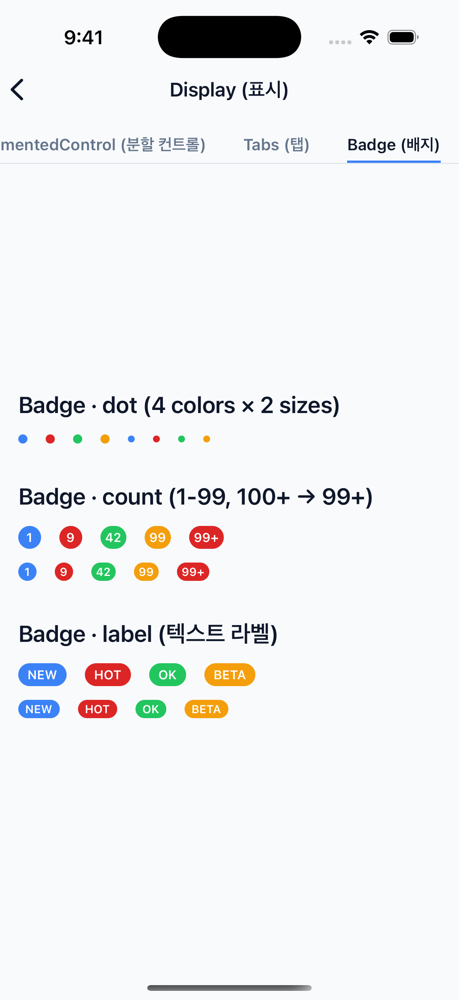 | 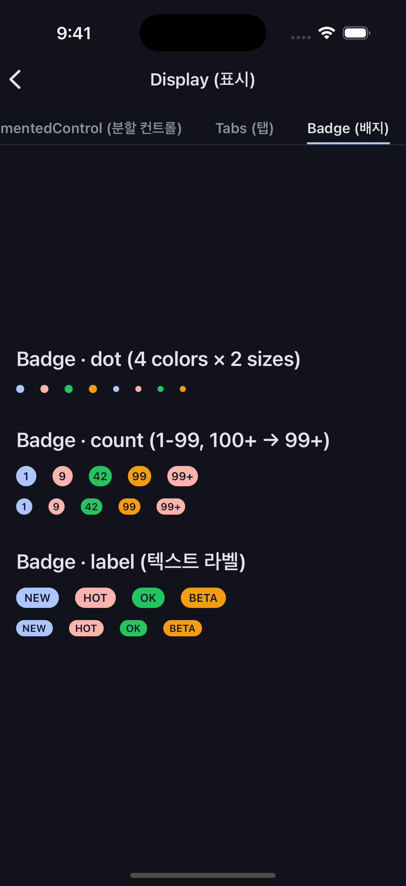 |

- `type='dot'`: `value` 불필요. 작은 원 표시
- `type='count'`: `value: number`. 100 이상은 `"99+"` 자동
- `type='label'`: `value: string`. 짧은 라벨 표시

```tsx
<Badge type="dot" color="success" />
<Badge type="count" value={3} color="destructive" />
<Badge type="count" value={150} />        // → "99+"
<Badge type="label" value="NEW" color="warning" />
```

### Chip

태그·필터·선택을 칩 형태로 표시합니다. 4 variant(filter/assist/input/suggestion)로 의미를 구분합니다. **InteractivePressableProps 포함**.

| prop | 타입 | 필수 | 기본값 |
|---|---|---|---|
| `variant` | `'filter' \| 'assist' \| 'input' \| 'suggestion'` | ✓ | — |
| `size` | `'sm' \| 'md'` | — | `'md'` |
| `label` | `string` | ✓ | — |
| `icon` | `ReactNode` | — | — |
| `selected` | `boolean` | filter 전용 | — |
| `onPress` | `() => void` | — | — |
| `onClose` | `() => void` | input 전용 | — |
| `disabled` | `boolean` | — | `false` |
| `style` | `StyleProp<ViewStyle>` | — | — |
| `accessibilityLabel` | `string` | — | — |

| Light | Dark |
|---|---|
|  |  |

- `filter`: `selected` 상태에 따라 ✓ 아이콘 + 채워진 배경
- `assist`/`input`: `icon`으로 leading 아이콘 표시
- `input`: `onClose`로 우측 X 버튼 표시
- `suggestion`: 보조 톤 텍스트 + 아이콘 없음

```tsx
import { Plus, Star } from 'lucide-react-native';

<Chip variant="filter" label="필터" selected={on} onPress={() => setOn(!on)} />
<Chip variant="assist" label="추가" icon={<Plus />} onPress={add} />
<Chip variant="input" label="태그" icon={<Star />} onClose={removeTag} onPress={open} />
<Chip variant="suggestion" label="제안" onPress={apply} />
```

---

## list

### SettingsRow

iOS HIG 설정 행 패턴의 컴포넌트입니다. `kind`로 6종의 행 형태(`'default' | 'toggle' | 'picker' | 'link' | 'action' | 'custom'`)를 선택하고, 각 kind마다 받는 props가 달라집니다. 하단 인셋 구분선은 `divider`(기본 `true`)로 제어하며, 그룹의 **마지막 행은 `divider={false}`**로 끕니다.

| prop | 타입 | 필수 | 기본값 |
|---|---|---|---|
| `kind` | `'default' \| 'toggle' \| 'picker' \| 'link' \| 'action' \| 'custom'` | ✓ | — |
| `label` | `string` | ✓ | — |
| `leadingIcon` | `ReactNode` | — | — |
| `divider` | `boolean` | — | `true` |
| `style` | `StyleProp<ViewStyle>` | — | — |

| Light | Dark |
|---|---|
| 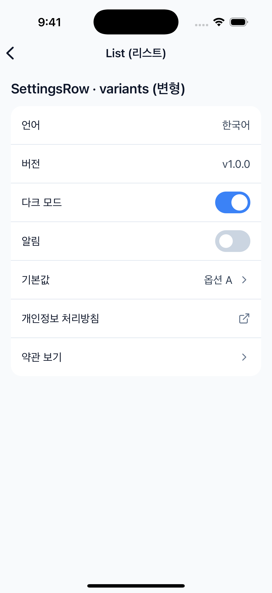 | 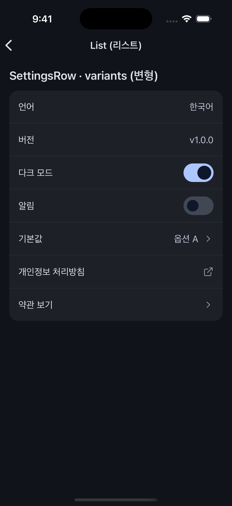 |

kind별 추가 props:

- `default`: `value: string` — 우측 보조 텍스트
- `toggle`: `value: boolean`, `onChange: (v: boolean) => void` — 우측 Switch
- `picker`: `value: string`, `onPress: () => void` — 우측 값 + chevron
- `link`: `onPress: () => void` — 우측 ExternalLink 아이콘 (외부 이동 등)
- `action`: `onPress: () => void` — 우측 ChevronRight 아이콘 (화면 내 진입)
- `custom`: `content: ReactNode` — 라벨 아래 full-width 컨텐츠(세로 블록). SegmentedControl 등 임의 컴포넌트 배치용

```tsx
import { Globe } from 'lucide-react-native';

<SettingsRow kind="default" label="버전" value="2.0.0" />
<SettingsRow kind="toggle" label="다크 모드" value={dark} onChange={setDark} />
<SettingsRow
  kind="picker"
  label="언어"
  value="한국어"
  leadingIcon={<Globe size={20} />}
  onPress={openLangPicker}
/>
<SettingsRow kind="link" label="문의하기" onPress={openContact} />
// 그룹의 마지막 행 — divider={false}
<SettingsRow kind="action" label="로그아웃" onPress={logout} divider={false} />

// custom — 라벨 + 임의 컴포넌트(예: SegmentedControl)
<SettingsRow
  kind="custom"
  label="테마"
  content={
    <SegmentedControl
      segments={[
        { value: 'dark', label: '다크' },
        { value: 'light', label: '라이트' },
        { value: 'system', label: '시스템' },
      ]}
      value={theme}
      onChange={setTheme}
    />
  }
/>
```

---

## feedback

### EmptyState

표시할 내용이 없을 때 안내합니다.

| prop | 타입 | 필수 | 기본값 |
|---|---|---|---|
| `icon` | `ReactNode` | — | — |
| `title` | `string` | ✓ | — |
| `description` | `string` | — | — |
| `action` | `EmptyStateAction` | — | — |
| `tone` | `'standard' \| 'subtle'` | — | `'standard'` |
| `style` | `StyleProp<ViewStyle>` | — | — |

*이미지 준비중*

`EmptyStateAction`은 `{ label: string; onPress: () => void }` 형태로, 표시 시 내부에 Button을 렌더합니다.

```tsx
import { Inbox } from 'lucide-react-native';

<EmptyState
  icon={<Inbox size={48} />}
  title="아직 결과가 없습니다"
  description="새로운 항목을 추가해보세요"
  action={{ label: '추가하기', onPress: handleAdd }}
/>
```

### ErrorView

오류 상황을 안내하고 재시도를 유도합니다. 아이콘 기본값은 `AlertCircle` + `state.error` 색.

| prop | 타입 | 필수 | 기본값 |
|---|---|---|---|
| `icon` | `ReactNode` | — | (AlertCircle) |
| `title` | `string` | ✓ | — |
| `description` | `string` | — | — |
| `action` | `ErrorViewAction` | — | — |
| `style` | `StyleProp<ViewStyle>` | — | — |

*이미지 준비중*

```tsx
<ErrorView
  title="네트워크 오류"
  description="연결을 확인하고 다시 시도해주세요"
  action={{ label: '다시 시도', onPress: retry }}
/>
```

### LoadingView

로딩 중을 안내합니다.

| prop | 타입 | 필수 | 기본값 |
|---|---|---|---|
| `message` | `string` | — | — |
| `size` | `'small' \| 'large'` | — | `'large'` |
| `style` | `StyleProp<ViewStyle>` | — | — |

*이미지 준비중*

```tsx
<LoadingView message="불러오는 중..." />
```

### Skeleton

콘텐츠 로딩 중 자리를 시각적으로 표시합니다. `type`으로 모양을 선택하고, 각 type마다 받는 props가 다릅니다.

| type | 추가 props |
|---|---|
| `'rect'` | `width: number`, `height: number` |
| `'circle'` | `size: number` |
| `'text'` | `lines?: number (기본 3)`, `lineWidths?: (number \| string)[]`, `lineHeight?: number` |

| Light | Dark |
|---|---|
|  |  |

```tsx
<Skeleton type="rect" width={200} height={16} />
<Skeleton type="circle" size={40} />
<Skeleton type="text" />                                  // 3줄 기본
<Skeleton type="text" lines={2} lineWidths={['100%', '70%']} />
```

### LinearProgress · CircularProgress

진행률을 막대(`LinearProgress`) 또는 원형(`CircularProgress`)으로 표시합니다. `variant`로 determinate/indeterminate를 선택합니다.

| prop | 타입 | 필수 | 기본값 |
|---|---|---|---|
| `variant` | `'determinate' \| 'indeterminate'` | — | `'determinate'` |
| `value` | `number` (0~100) | determinate 필수 | — |
| `size` | `'sm' \| 'md' \| 'lg'` | — | `'md'` |
| `style` | `StyleProp<ViewStyle>` | — | — |
| `testID` | `string` | — | — |
| `accessibilityLabel` | `string` | — | — |

| Light | Dark |
|---|---|
| 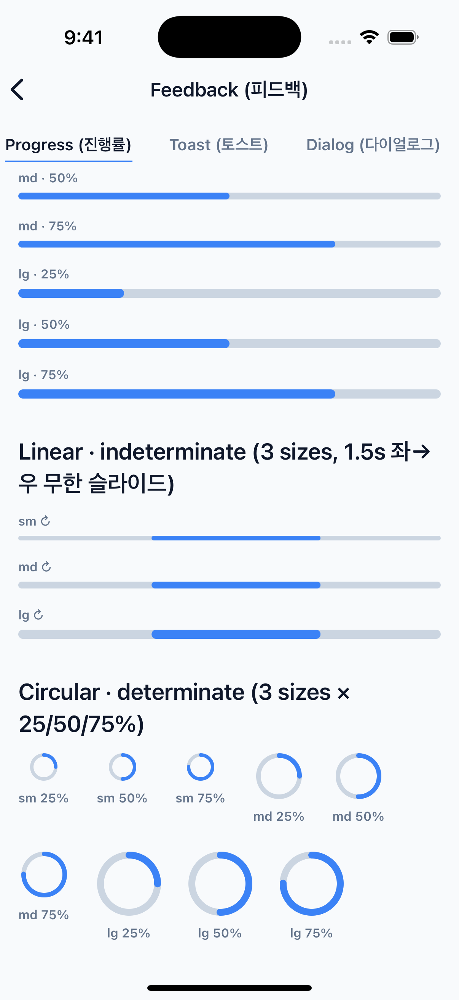 | 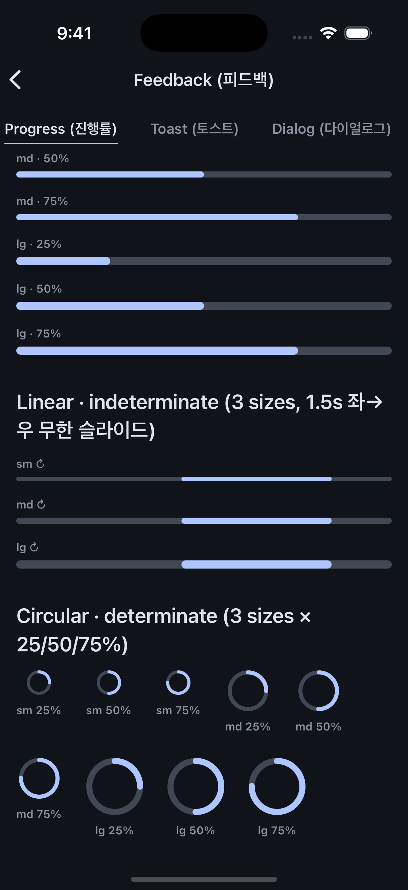 |

`variant='determinate'`(생략 가능)에서는 `value`가 필수입니다. `indeterminate`는 무한 애니메이션으로 진행 단계를 모를 때 사용합니다.

```tsx
<LinearProgress value={50} />
<LinearProgress value={75} size="lg" />
<CircularProgress value={50} size="md" />

<LinearProgress variant="indeterminate" />
<CircularProgress variant="indeterminate" size="sm" />
```

### Tooltip

자식 요소를 길게 누르면 짧은 설명을 표시합니다. `children`은 `onLongPress`를 받을 수 있는 요소여야 합니다.

| prop | 타입 | 필수 | 기본값 |
|---|---|---|---|
| `text` | `string` | ✓ | — |
| `position` | `'top' \| 'bottom' \| 'left' \| 'right'` | — | `'top'` |
| `visible` | `boolean` | — | — |
| `autoDismissDelay` | `number` (ms) | — | `1500` |
| `children` | `ReactElement` | ✓ | — |
| `style` | `StyleProp<ViewStyle>` | — | — |
| `testID` | `string` | — | — |
| `accessibilityLabel` | `string` | — | — |

| Light | Dark |
|---|---|
| 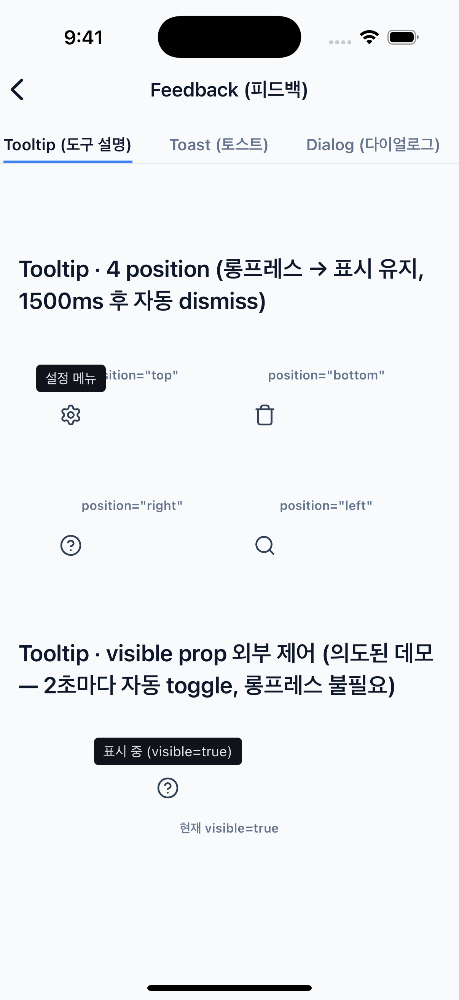 | 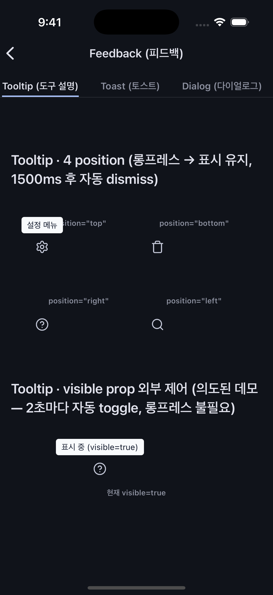 |

`visible`을 지정하면 외부 제어 모드로 동작합니다(onboarding 등). 미지정 시 자동 모드 — 롱프레스로 열리고 `autoDismissDelay` 후 닫힙니다.

`children`은 `onLongPress`를 수용하는 요소여야 합니다. 라이브러리의 인터랙티브 컴포넌트(Button/IconButton/FAB/Chip/Switch)는 모두 호환되며, RN `Pressable`/`TouchableOpacity`로 직접 감싸도 됩니다. 단순 `View`는 RN Touch Responder 본질상 직접 호환되지 않으므로 `Pressable`로 감싸 사용합니다.

```tsx
import { Settings } from 'lucide-react-native';

<Tooltip text="설정 메뉴">
  <IconButton icon={<Settings />} onPress={openSettings} accessibilityLabel="설정" />
</Tooltip>

<Tooltip text="삭제합니다" position="bottom">
  <IconButton icon={<Trash />} onPress={remove} accessibilityLabel="삭제" />
</Tooltip>
```

---

## modal

modal 카테고리에는 시각 컴포넌트 4종(`Toast`, `Dialog`, `BottomSheet`, `Popup`)과 그에 대응하는 Host 컴포넌트 4종(`ToastHost`, `DialogHost`, `BottomSheetHost`, `PopupHost`)이 있습니다. 일반적인 사용에서는 시각 컴포넌트를 직접 렌더하지 않고 imperative API(`toast`/`dialog`/`bottomSheet`/`popup`)로 띄웁니다. 셋업·호출 방법은 [docs/imperative.md](imperative.md)에 정리되어 있습니다.

시각 컴포넌트는 controlled 모드(`visible` prop)로 직접 렌더할 수도 있습니다.

### Toast

| prop | 타입 | 필수 | 기본값 |
|---|---|---|---|
| `config` | `ToastConfig` | ✓ | — |
| `onDismiss` | `() => void` | ✓ | — |

| Light | Dark |
|---|---|
|  | 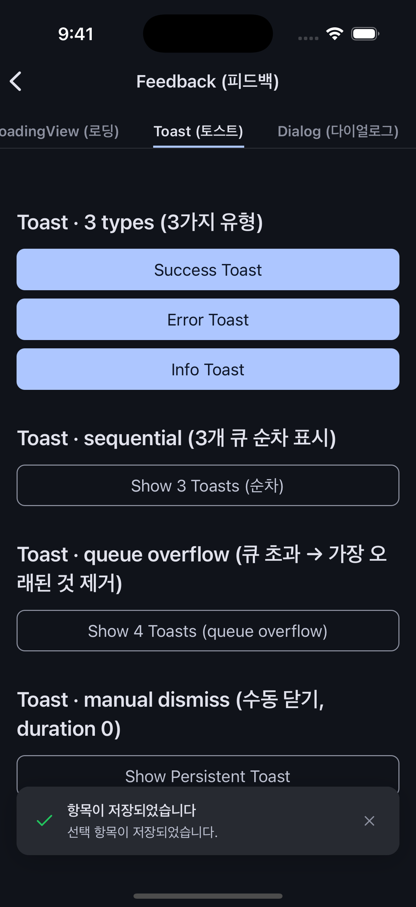 |

### Dialog

| prop | 타입 | 필수 | 기본값 |
|---|---|---|---|
| `config` | `DialogConfig` | ✓ | — |
| `onResolve` | `(value: unknown) => void` | ✓ | — |

| Light | Dark |
|---|---|
|  | 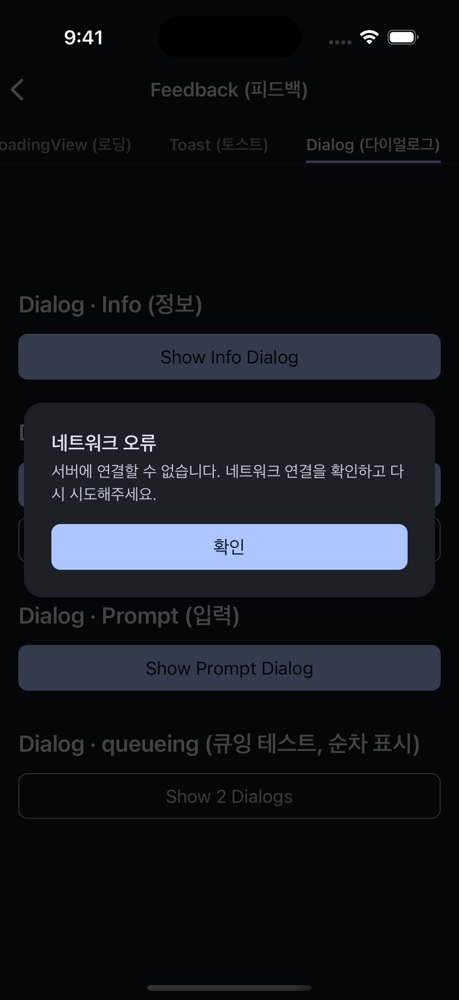 |

### BottomSheet

화면 아래에서 올라오는 시트. 단일 snap, 다중 snap, scrollable, 키보드 양립까지 지원합니다.

| prop | 타입 | 필수 | 기본값 |
|---|---|---|---|
| `visible` | `boolean` | ✓ | — |
| `onDismiss` | `() => void` | ✓ | — |
| `height` | `'auto' \| \`${number}%\` \| number` | — | `'auto'` |
| `snapPoints` | `BottomSheetSnap[]` | — | — |
| `initialSnap` | `number` | — | `0` |
| `onSnapChange` | `(index: number) => void` | — | — |
| `children` | `ReactNode` | ✓ | — |

**단일 snap**

| Light | Dark |
|---|---|
| 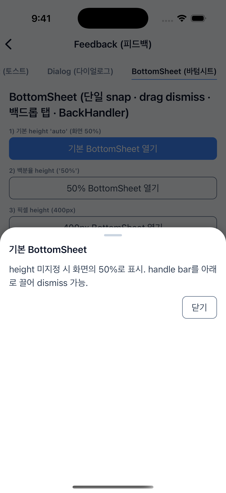 | 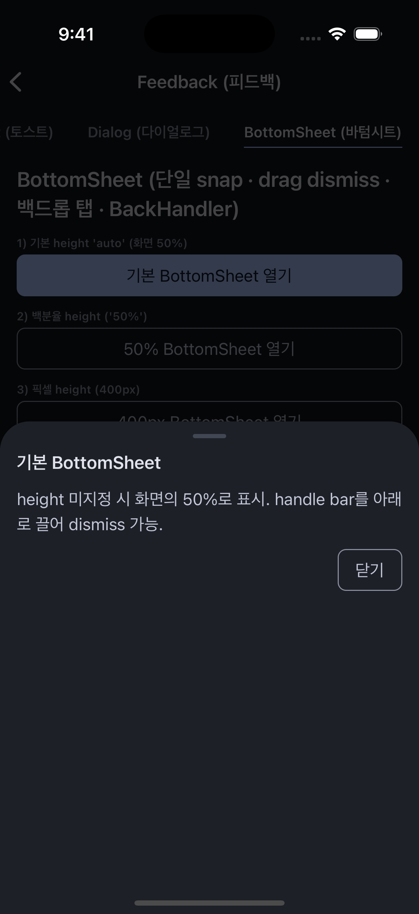 |

**다중 snap**

| Light | Dark |
|---|---|
| 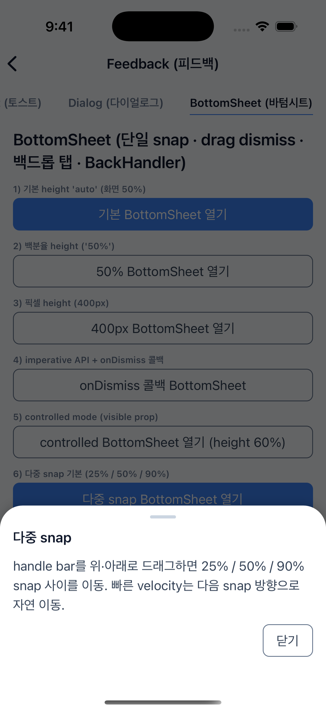 | 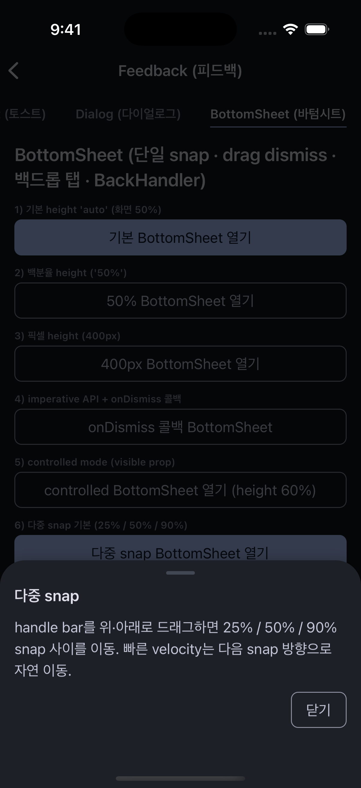 |

**Scrollable**

| Light | Dark |
|---|---|
| 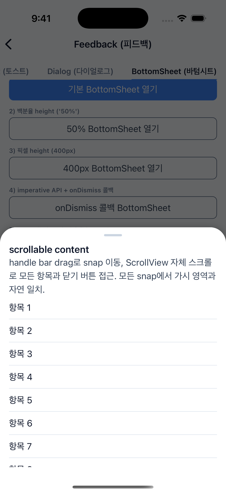 | 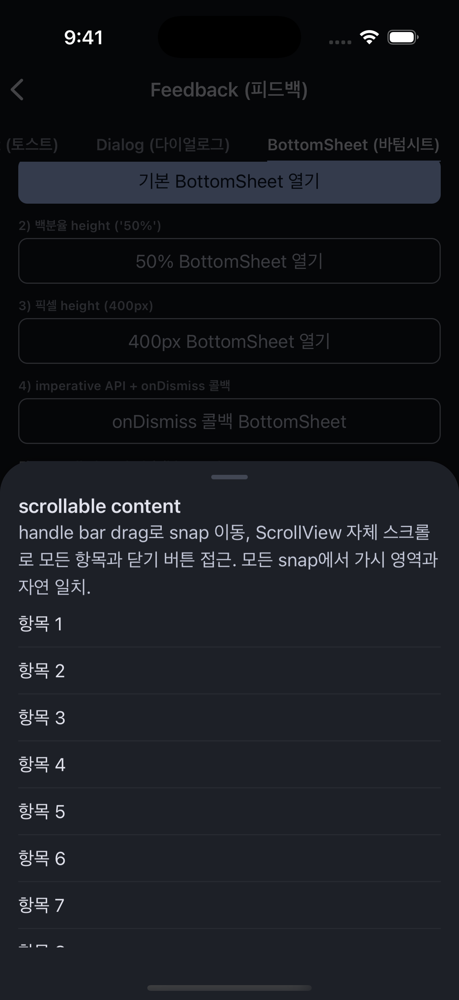 |

**키보드 양립**

| Light | Dark |
|---|---|
| 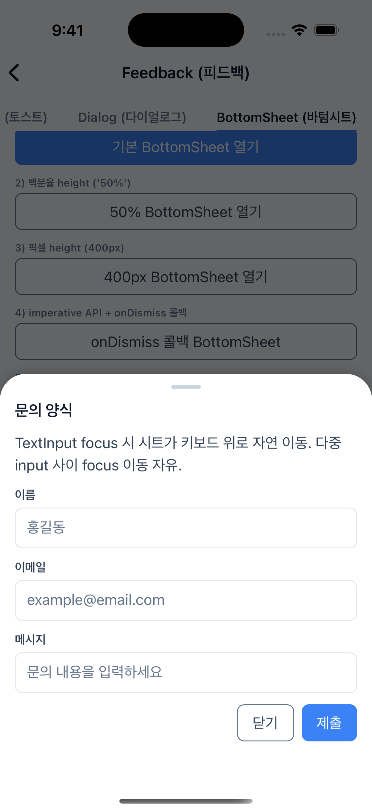 | 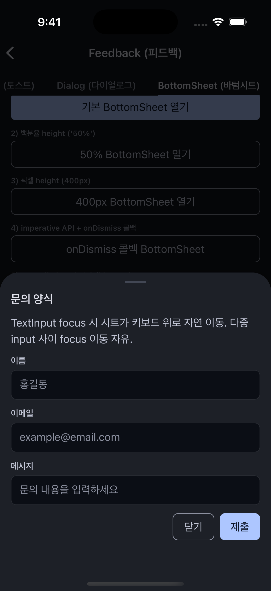 |

`snapPoints`를 지정하면 다중 snap 모드로 동작하고, 미지정 시 `height` 기준 단일 snap입니다. `BottomSheetSnap`은 `'auto' | \`${number}%\` | number` 형태로 자유 혼합 가능합니다.

```tsx
const [visible, setVisible] = useState(false);

<BottomSheet
  visible={visible}
  onDismiss={() => setVisible(false)}
  snapPoints={['25%', '50%', '90%']}
  initialSnap={1}
>
  <Text>콘텐츠</Text>
</BottomSheet>
```

### Popup

화면 중앙 입력 모달. RadioGroup / Checkbox / 다중 Input을 자유 배치한 form에 적합합니다.

| prop | 타입 | 필수 | 기본값 |
|---|---|---|---|
| `visible` | `boolean` | ✓ | — |
| `onDismiss` | `() => void` | ✓ | — |
| `children` | `ReactNode` | ✓ | — |

**RadioGroup 선택**

| Light | Dark |
|---|---|
|  |  |

**Checkbox 다중 선택**

| Light | Dark |
|---|---|
|  |  |

**다중 Input form**

| Light | Dark |
|---|---|
|  |  |

```tsx
const [visible, setVisible] = useState(false);

<Popup visible={visible} onDismiss={() => setVisible(false)}>
  <ThemeSelector onPick={(t) => { applyTheme(t); setVisible(false); }} />
</Popup>
```

---

## icons

lucide-react-native로 커버되지 않는 아이콘을 직접 정의하기 위한 경량 SVG 팩토리입니다. `createIcon`은 lucide와 동일한 props(`size` / `color` / `strokeWidth`)를 노출하므로 소비 측 사용법이 lucide 아이콘과 완전히 동일합니다. 컴포넌트 간 공유가 필요한 아이콘(예: Checkbox·OptionCard가 함께 쓰는 `Check`)은 여기서 단일 정의해 중복을 없앱니다.

### createIcon

`createIcon(paths, viewBox?)` — path `d` 문자열(또는 배열)로 아이콘 컴포넌트를 만든다.

| 인자 | 타입 | 기본값 |
|---|---|---|
| `paths` | `string \| string[]` | — |
| `viewBox` | `string` | `'0 0 24 24'` |

반환 컴포넌트 props(`IconProps`): `size`(기본 24) · `color`(기본 `'currentColor'`) · `strokeWidth`(기본 2) + `react-native-svg`의 `SvgProps`.

```tsx
import { createIcon } from '@junkwon91/rn-design-system';

export const Check = createIcon('M5.1 12.5 L9.9 17.1 L18.9 7.2');

<Check size={16} color={theme.colors.primary.onAction} />
```

### Check

체크 표시 아이콘. Checkbox·OptionCard의 선택 표시에 공용으로 쓰인다.
